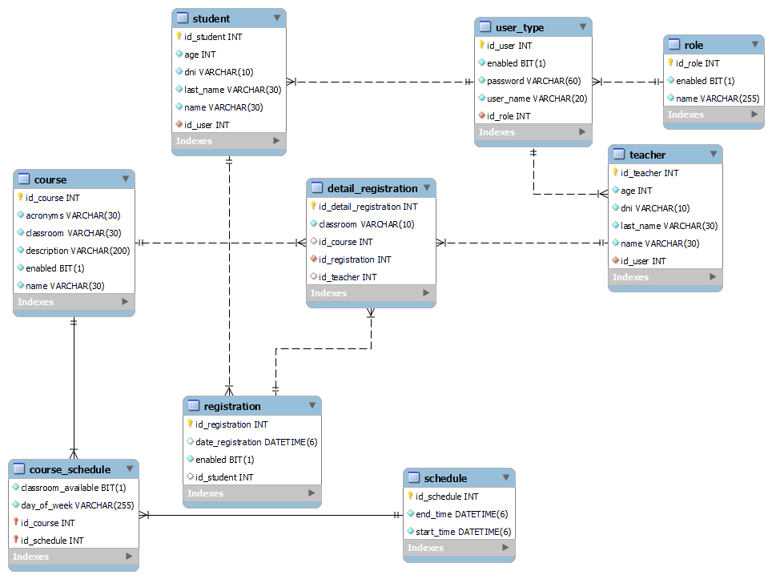

# Project-School
Desarrollo de una API REST para un sistema de gestión escolar utilizando Java y Spring Boot. Implementación del paradigma funcional para el tratamiento de datos. Pruebas unitarias desarrolladas con JUnit y Mockito para prever y verificar su correcto funcionamiento. Además, integración con Spring Security para proporcionar una capa adicional de seguridad y fiabilidad; cuenta con documentacion mediante Swagger.
## Diagrama entidad - relacion

 
